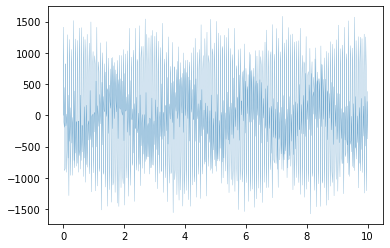
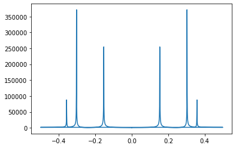
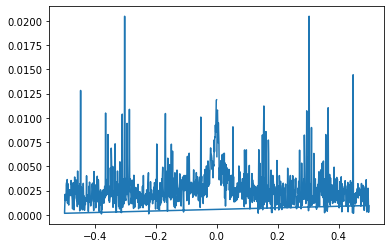

Creating a 1024 Point **FFT Implementation**.
Software Used: Xilinx Vivado 19.2
Hardware Used: PYNQ-Z1 FPGA Board


# Importing Overlay


```python
from pynq import Overlay
```


```python
overlay = Overlay("./fft_1024.bit")
overlay?
```


```python
data_channel = overlay.fft_block.fft_dma
data_channel?
```

## Data Creation


```python
import numpy as np
import matplotlib.pyplot as plt
import random
```


```python
samples = 1024
T = 10
f1 = random.uniform(10,50)
f2 = random.uniform(10,50)
f3 = random.uniform(10,50)
w1 = 2*np.pi*f1
w2 = 2*np.pi*f2
w3 = 2*np.pi*f3
A1 = random.uniform(100, 1000)
A2 = random.uniform(100, 1000)
A3 = random.uniform(100, 1000)
t = np. linspace(0,T, samples)

data = A1*np.sin(w1*t) + A2*np.sin(w2*t) + A3*np.sin(w3*t)
```


```python
plt.plot(t, data, linewidth = 0.2)
```


    [<matplotlib.lines.Line2D at 0xab445508>]


    

    


## CPU Implementation


```python
import time
start_time = time.time()
golden_output = np.fft.fft(data)
end_time = time.time()
sw_exec_time = end_time-start_time
print("Software Execution Time: ", sw_exec_time)
```

    Software Execution Time:  0.0018451213836669922


```python
freq = np.fft.fftfreq(samples)
freq
```


    array([ 0.        ,  0.00097656,  0.00195312, ..., -0.00292969,
           -0.00195312, -0.00097656])


```python
plt.plot(freq, np.abs(golden_output))
```


    [<matplotlib.lines.Line2D at 0xab3d8178>]


    

    


## PL Implementation


```python
from pynq import allocate
```


```python
input_buffer = allocate((1024,), np.csingle)
output_buffer = allocate((1024,), np.csingle)

np.copyto(input_buffer, data)
input_buffer
```


    PynqBuffer([   0.     +0.j, 1411.7784 +0.j, -104.79156+0.j, ...,
                 222.78162+0.j, -377.02924+0.j,  383.07367+0.j],
               dtype=complex64)


```python
start_time = time.time()

data_channel.sendchannel.transfer(input_buffer)
data_channel.recvchannel.transfer(output_buffer)
data_channel.sendchannel.wait()
data_channel.recvchannel.wait()

end_time = time.time()
hw_exec_time = end_time - start_time
print("Hardware Execution time: ", hw_exec_time)
print("Software Execution time: ", sw_exec_time)
```

    Hardware Execution time:  0.008203744888305664
    Software Execution time:  0.0018451213836669922


The Execution time of both hardware and software is comparable in this case (1024 point fft). With higher point ffts the hardware acceleration will show significant improvements. The purpose of this notbook is to understand the flow of implementation.


```python
plt.plot(freq, np.abs(output_buffer))
```


    [<matplotlib.lines.Line2D at 0xab396268>]


    

    


```python
plt.plot(freq, np.abs((golden_output) - (output_buffer)))
```


    [<matplotlib.lines.Line2D at 0xab36d940>]


    

    

